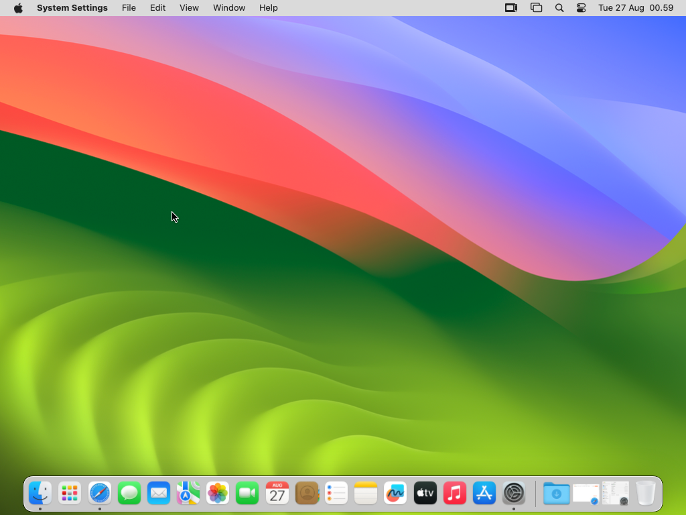
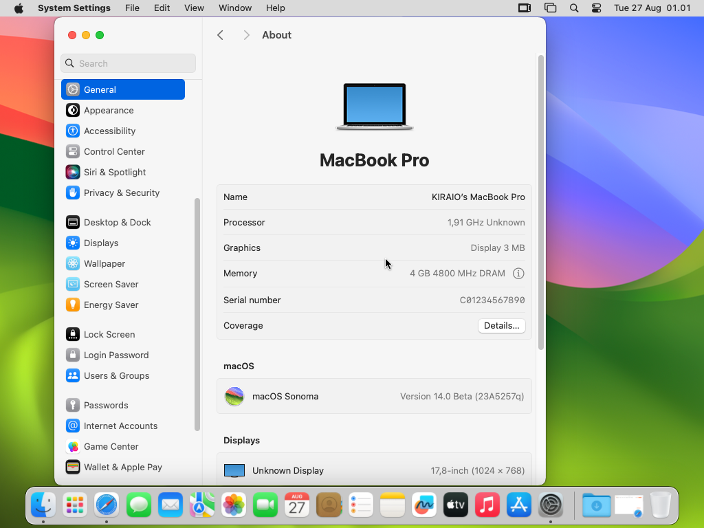

<div align="center">
    
    <h1>Install MacOS on VMWare</h1>
</div>



## Prerequisite

- Download & Install [VMWare Workstation](https://www.techspot.com/downloads/189-vmware-workstation-for-windows.html "Download VMWare Workstation on TechSpot").
- Download & Extract [VMWare Auto Unlocker](https://github.com/paolo-projects/auto-unlocker/releases "Download VMWare Auto Unlocker on GitHub").
- Download one of the [Mac ISO's](https://data.pyenb.network/macOS/isos/ "Visit Pyenb Mac ISO's repository").
  > [!NOTE]  
  > VMWare Auto Unlocker support macOS up to version 14.

## How To

### Patching VMWare

- Close any VMWare Workstation instances.
- Open VMWare Auto Unlocker `Unlocker.exe` as Administrator.
- Because of the bug in the unlocker program ([paolo-projects/auto-unlocker#125](https://github.com/paolo-projects/auto-unlocker/issues/125)), you've to do this:

  > [!IMPORTANT]  
  > If you've already patched the VMWare Workstation before, uninstall the patch first in the unlocker program.

  - Download both `darwin.iso` & `darwinPre15.iso` in <https://packages.vmware.com/tools/frozen/darwin/> and put them in a folder.
  - In the unlocker program, uncheck `Download tools` and browse the directory containing the files you've downloaded.
- Patch the VMWare Workstation!

### Creating macOS VM

- Open VMWare Workstation and click continue as free non-commercial use.
- Create a VM:
  - Configuration: Custom
  - Hardware Compatibility: Default (Workstation 17.5.x)
  - Image File:  Point to the ISO file you've downloaded
  - OS: Apple Mac OS X
  - Version: Depend on what Mac OS version you've downloaded
  - Name & Location: Whatever you like. Remember the name & the path!
  - Processors: Default or more (Depend on your system)
  - RAM: 2 GB or more (Depend on your system)
  - Network: Default (NAT)
  - I/O: Default (LSI Logic)
  - Virtual Disk: Default (SATA)
  - Disk: Create New. 35 GB or more. Split Virtual Disk. Default Name.
  - 🤜 Finish it! 
- Remember the location of your VM that you've just created?  
  Open `{Your VM Name}.vmx` in a text editor:
  - Set `board-id.reflectHost = "FALSE"`.
  - Set `ethernet0.virtualDev = "vmxnet3"`.
  - Add:
    ```
    board-id = "Mac-AA95B1DDAB278B95"
    hw.model.reflectHost = "FALSE"
    hw.model = "MacBookPro19,1"
    serialNumber.reflectHost = "FALSE"
    serialNumber = "C01234567890"
    ```
- 💾 Save it.

### Installing macOS

- Power On your VM!
- Wait until all initialization is complete.
- Select your language.
- Select Disk Utility.
- Select the `VMware Virtual SATA Hard Drive Media` > Click Erase.
- Name the drive > Format to APFS > Erase.
- Click Done > Close ❌ the Disk Utility.
- Install macOS. The VM will be rebooted several times.
- Follow the typical OS installation. *(Basically **Not Now** or **Skip**)*
- You're done! Enjoy ;)



## Credits

- [i12bretro](https://github.com/i12bretro) for [Running a MacOS 14 Sonoma VM in VMware](https://i12bretro.github.io/tutorials/0602.html).
